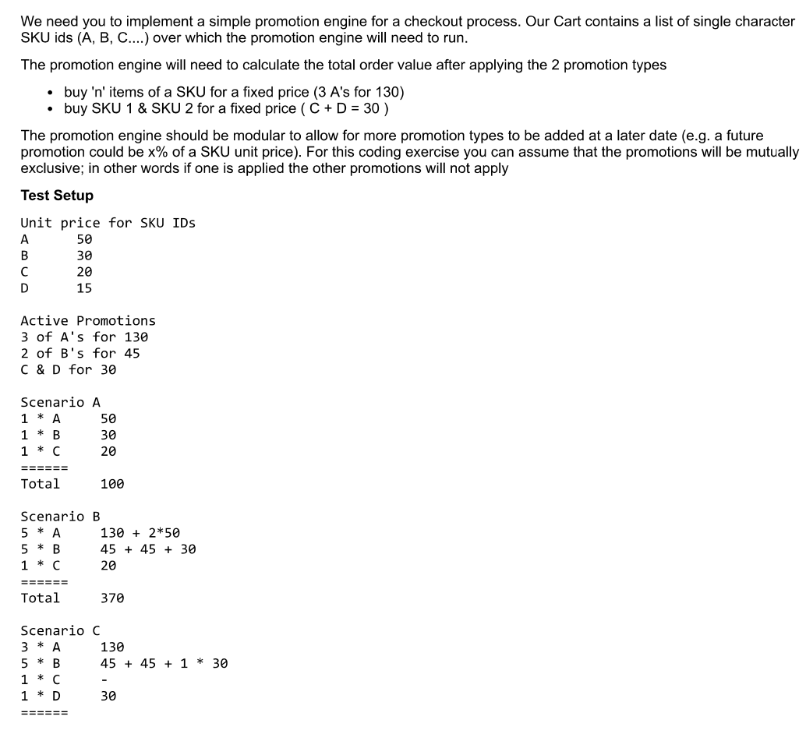

# NRuleExplore
## Exploring NRule by using simple rules

We are implementing following problem statement by implementing a simple rule engine based on [NRules](https://github.com/NRules/NRules) library:

## *Below are the considerations:*

 - Used [NRules](https://github.com/NRules/NRules) as rule engine library. It is open source and light weight
 - Used Clean Architecture
 - Rules are modular
 - Here for sake of simplicity, we took ***SKU Price*** list as lookup(but could be easily converted back to be configurable)
 - Unit test done for all above test scenarios only (as needed to quickly wrap-up and need to make sure, the engine does what it needs to be)
 - Main application, in case somebody needs to run is Console Application. However, as I have followed Clean Architecture, it could be seamlessly plugged for web-api or MVC
 - Rules are not mutually exclusive, i.e. multiple rules run for same set of input

## Architecture ##

## Scope of future developments ##

- More elaborate test cases
- Better naming and access controls
- Dynamic injectable rules using RuleSharp
- More code clean-up
- Apifyig the engine
- Create a pipeline to move it as an image to public cloud
- etc
